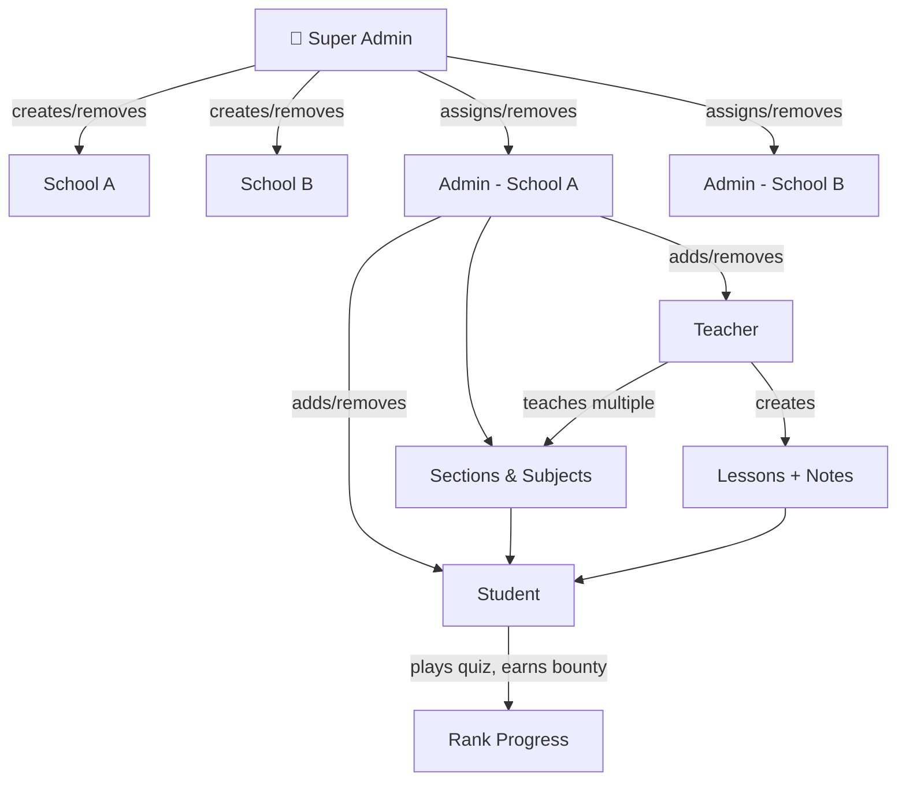
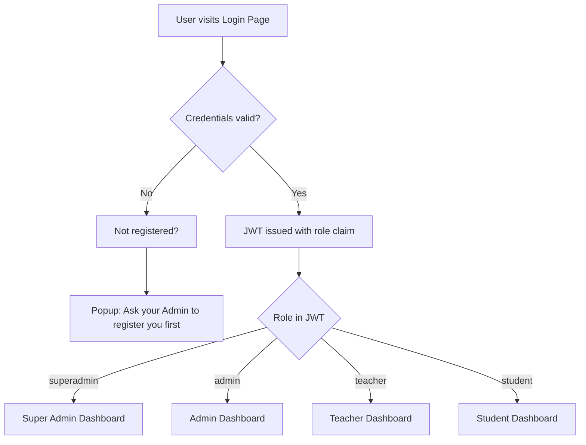
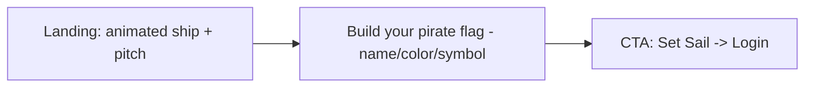
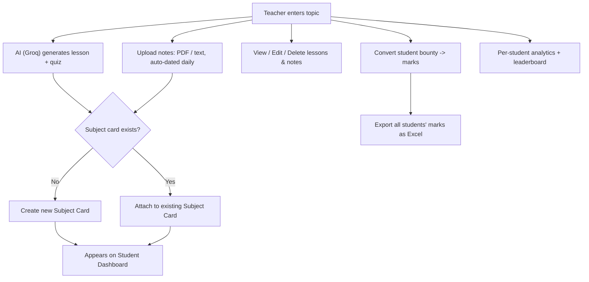
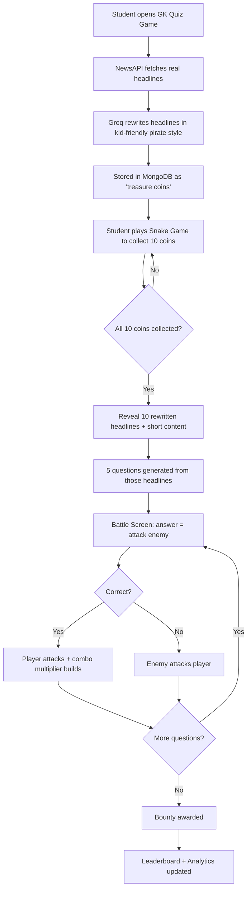
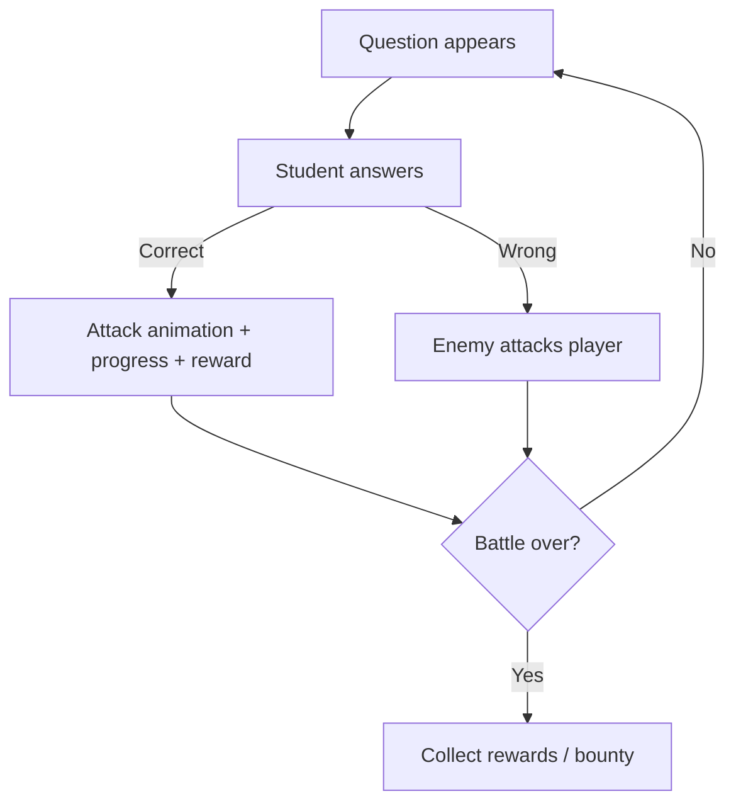
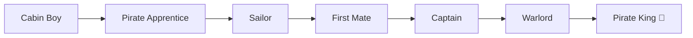

# 🏴‍☠️ StudyVerse

**A multi-tenant, pirate-themed LMS that turns boring lessons into a game.**

StudyVerse lets schools onboard teachers and students, run AI-generated lessons/quizzes, and gamify learning through a rank system (Cabin Boy → Pirate King). Core engine is theme-agnostic — pirates today, space/ninja/medieval tomorrow — same battle logic, different skin.

---

## 1. Roles & Hierarchy

- **Super Admin** (server-side, us): adds/removes schools, adds/removes school admins, handles escalated issues.
- **Admin** (per school): manages teachers, students, sections, resolves school-level issues.
- **Teacher**: owns sections/subjects, creates lessons + notes, grades bounties → marks, views analytics.
- **Student**: consumes lessons/notes, plays quiz battles, earns bounty → rank, checks leaderboard.

Registration is backend-only — no public signup. Admin registers teachers/students first; unregistered users trying to log in get a "contact your admin to register" prompt.

---

## 2. Login Flow

One unified login page. JWT decides role → redirect to the right dashboard. No self-signup for teacher/student — only admin-created accounts (or their own Google account tied to the record) can log in.

---

## 3. Landing / Index Page

Not a static page — a mini interactive intro:
- Animated ship sailing across the screen ("set sail" feel).
- Short pitch: what StudyVerse is, pirate framing, no emoji spam — real illustration/animation instead.
- Interactive bit: user builds a **pirate flag** (pick name, color, symbol) before entering — light onboarding hook, not a gimmick tacked on.
- CTA → Login.

---

## 4. Teacher Workflow: Lessons & Notes

Teacher writes a topic → AI (Groq) generates the lesson + quiz in one click. Everything a teacher uploads (first lesson or note) auto-creates a **subject card** that bundles both lessons and notes together.

---

## 5. Student Flow: News Snake Game → Quiz Battle

This is the core engagement loop, solving the "reading news is boring" problem.

---

## 6. Core Battle Engine (Theme-Agnostic)

**Key decision: don't build "a pirate game" — build one game engine with swappable skins.** Same logic every time; only visuals/story rotate (weekly, not daily — avoids burnout, keeps anticipation).

### Theme Skin Table (engine never changes, only these swap)

| Theme | Player | Enemy | Attack Animation |
|---|---|---|---|
| Pirate | Ship | Enemy ship | Cannon |
| Space | Spaceship | Alien fleet | Laser |
| Medieval | Knight | Dragon | Sword |
| Ninja | Ninja | Demon | Shuriken |
| Jungle | Explorer | Tiger | Arrow |
| Underwater | Dolphin rider | Shark | Water blast |
| Cyberpunk | Hacker | Robot | EMP attack |
| Fantasy | Wizard | Dark spirit | Magic spell |
| Viking | Viking ship | Sea serpent | Axe throw |
| Samurai | Samurai | Oni | Katana slash |

Rotation cadence: **weekly** theme swap, plus limited-time event skins (Halloween, Christmas, Summer). No copyrighted characters/IP — all original designs per theme. "Today's Adventure: 🏴 Pirate Sea" style reveal builds anticipation on load.

---

## 7. Ranking System

Bounty (earned from quiz battles) accumulates into rank progression:

*(Exact tier names/thresholds are tunable — this is the shape, not final copy.)*

---

## 8. Dashboards Summary

| Role | Sees |
|---|---|
| Super Admin | All schools, add/remove schools & admins, escalated issue resolution |
| Admin | Teachers, students, sections, subjects for their school; issue handling |
| Teacher | Lesson/notes creation (manual + AI), student analytics, marks export, leaderboard |
| Student | Subject cards (lessons + notes), quiz battles, bounty/rank, leaderboard, own analytics |

---

## 9. Tech Stack (from build so far)

- **Frontend**: separate repo, HTML/CSS/JS (component files kept separate, not bundled as zips)
- **Backend**: Node/Express + MongoDB Atlas, JWT auth, Helmet + rate limiting, soft deletes
- **AI**: Groq (lesson generation, headline rewriting)
- **News**: NewsAPI
- **Storage**: Cloudinary (PDF notes) + Google Docs viewer for inline preview
- **Deployment**: Render (frontend + backend as separate services)

---

## 10. What's Explicitly Out of Scope (for now)

- No public self-signup — admin-provisioned accounts only
- No daily theme swaps — weekly, to avoid dilution
- No reused copyrighted characters in any theme skin — all original art direction
